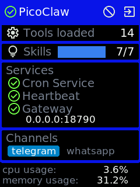
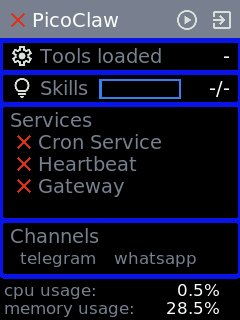
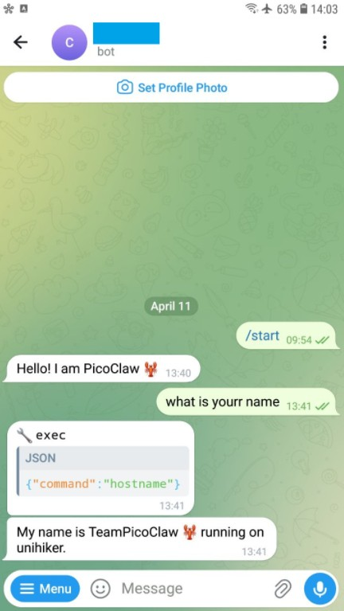
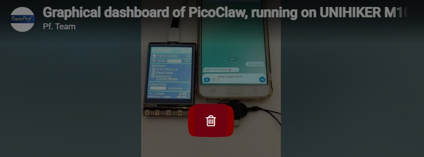

# Dashboard of running PicoClaw on UNIHIKER M10

## Introduction 
This project leverages the UNIHIKER GUI library to implement a graphical dashboard for PicoClaw, running on the UNIHIKER M10 SBC.
Before starting, **ensure that PicoClaw is properly set up** and running on the UNIHIKER M10. For detailed instructions, please refer to [Running PicoClaw on UNIHIKER M10](https://community.dfrobot.com/makelog-318617.html)

[](https://github.com/teamprof/pico-audio-ml/blob/main/LICENSE)  
<a href="https://www.buymeacoffee.com/teamprof" target="_blank"></a>


## Software setup
Run the following commands to clone the project repository and install the required libraries.
```
git clone https://github.com/teamprof/unihiker-picoclaw.git
cd unihiker-picoclaw/dashboard
pip install -r requirements.txt
```

## Run dashboard app
- Ensure that the PicoClaw binary file is located at "/root/picoclaw/picoclaw", or update "config.py" to set the correct path
```
PATH_PICOCLAW = "/root/picoclaw/picoclaw"
```
- Launch the dashboard by executing the following command.
```
python main.py
```
If everything goes smoothly, you should see the following screen.  
[](https://github.com/teamprof/unihiker-picoclaw/blob/main/assets/screen-start.png)  
PicoClaw is now successfully running on your UNIHIKER M10.


### Stop PicoClaw
Stop PicoClaw by click the stop icon [](https://github.com/teamprof/unihiker-picoclaw/blob/main/dashboard/assets/stop.png)
or press the Button A  
The following screen shows PicoClaw is stopped.   
[](https://github.com/teamprof/unihiker-picoclaw/blob/main/assets/screen-stop.png)


### Start PicoClaw
Start PicoClaw by click the start icon [](https://github.com/teamprof/unihiker-picoclaw/blob/main/dashboard/assets/start.png)
or press the Button A 

### Test 
- Send the message "what is your name" on Telegram.
- Wait to receive the response.  
[](https://github.com/teamprof/unihiker-picoclaw/blob/main/assets/picoclaw-tg.jpg)  


### Exit dashboard app
click the exit icon 
[](https://github.com/teamprof/unihiker-picoclaw/blob/main/dashboard/assets/exit.png)
or press the Button B to exit the dashboard

### Video demo
Video demo is available on [video demo](https://youtube.com/shorts/2kDmuJmmUu4)  
[](https://youtube.com/shorts/2kDmuJmmUu4)  


## License
- The project is licensed under GNU GENERAL PUBLIC LICENSE Version 3
---

## Copyright
- Copyright 2026 teamprof.net@gmail.com. All rights reserved.

