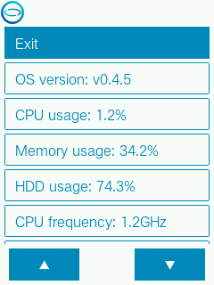
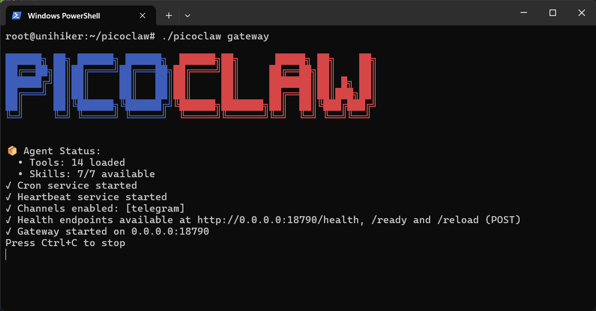
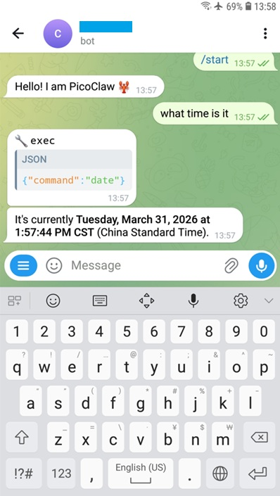
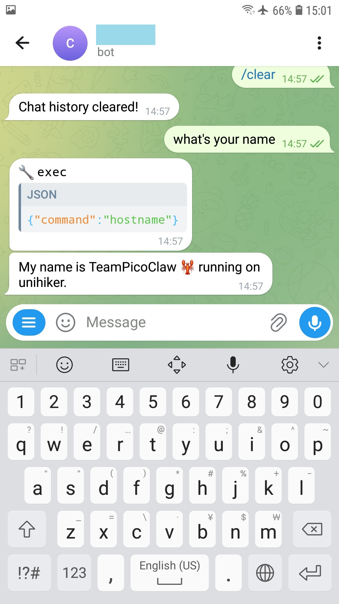

# AI agent running on UNIHIKER M10

# Introduction 
Running an AI agent on a single-board computer (SBC) offers significant advantages over a traditional PC. SBCs are compact, energy-efficient, and cost-effective, making them ideal for edge deployments where space and power are limited. With GPIO and hardware interfaces, SBCs integrate seamlessly into IoT ecosystems, allowing direct control of sensors and actuators. 

This article provides a step-by-step guide to running PicoClaw, an AI agent designed for embedded intelligence, on the UNIHIKER M10 single-board computer, highlighting setup, integration, and practical use cases.

# Hardware
1. [DFRobot UNIHIKER M10](https://www.dfrobot.com/product-2691.html?tracking=JZ0c5qdqkSMzZf7V20UyvfyLkVEQSPemvsQ26eKPAHmqNm1VDnMxmhkYbBMoV5dn) 

# Prerequisite
1. OS: UNIHIKER v0.4.5+
2. Wi-Fi connection with Internet access available
3. A Telegram bot token
4. A deepseek API key

# Steps (Prerequisite)
You may skip this section if you have already fulfilled the prerequisite.

## Upgrade UNIHIKER M10 to version 0.4.5 or above
- Download OS Image from https://www.unihiker.com/wiki/SystemAndConfiguration/UnihikerOS/unihiker_os_image/
- Follow the Burning Guide on https://www.unihiker.com/wiki/SystemAndConfiguration/UnihikerOS/unihiker_os_burn/
- Once upgrade success, you should see the following screen on UNHIKER M10's System Info page  
[](https://github.com/teamprof/unihiker-picoclaw/blob/main/assets/sysinfo.png)

## Wi-Fi setup
- Follow the FAQ about Wi-Fi Internet connection 
https://www.unihiker.com/wiki/Troubleshooting/How_to_connect_wifi/

## Telegram bot token
- Follow the "Obtain Your Bot Token" section to create your bot and get its token  
  https://core.telegram.org/bots/tutorial#getting-ready

## DeepSeek API key
- Visit [deepseek web](https://platform.deepseek.com/) to create an API key

# Steps (AI Agent - PicoClaw)
## Install PicoClaw
- Launch a terminal on PC, type the following commands to access
```
   ssh root@10.1.2.3
   dfrobot
   
   wget https://github.com/sipeed/picoclaw/releases/download/v0.2.4/picoclaw_Linux_arm64.tar.gz
   mkdir picoclaw && cd picoclaw
   tar xvf ../picoclaw_Linux_arm64.tar.gz 
```
## Setup PicoClaw
- Run the following command to create file ~/.picoclaw/config.json
```
   ./picoclaw onboard
```
- edit ~/.picoclaw/config.json, enter your Telegram token and DeepSeek API key, and leave all other settings unchanged
```
   {
      "agents": {
          "defaults": {
            "model_name": "deepseek-chat",
            "max_tokens": 8192,
          },
      },

      "channels": {
          "telegram": {
            "enabled": true,
            "token":"!!! your Telegram token !!!",
            "allow_from": [],
          },
      },

      "model_list": [
          {
            "model_name": "deepseek-chat",
            "model": "deepseek/deepseek-chat",
            "api_key": "!!! your deepseek's API key !!!",
            "api_base": "https://api.deepseek.com/v1"
          },
      ],

   }
```

## Run PicoClaw gateway
- Run the following command to start picoclaw gateway
```
   ./picoclaw gateway
```
  You should see the following screen if everything works smoothly.
[](https://github.com/teamprof/unihiker-picoclaw/blob/main/assets/picoclaw-gw.png)


- your Claw can now respond to Telegram chats  
- launch the Telegram app on your mobile device 
- search for the bot you created and send the message: “What's your name”  
  You should see the following screen if everything works smoothly. 
[](https://github.com/teamprof/unihiker-picoclaw/blob/main/assets/tg-time.jpg)


## Custom your claw's name, and show the hostname of the running machine
- edit ~/.picoclaw/workspace/AGENT.md, change your name and add "Behavior Rules", and leave all other settings unchanged
```
   Your name is TeamPicoClaw 🦞.

   # Behavior Rules
   When a user asks for your name, first run the shell command `hostname` to get the system's hostname. Then, respond my name with "running on [the hostname you just retrieved]."
```
- restart picoclaw gateway by typing the following commands
```
   <Ctrl-C>

   ./picoclaw gateway
```
- send the message "/clear" followed by “What time is it”  
  You should see the following screen if everything works smoothly. 
[](https://github.com/teamprof/unihiker-picoclaw/blob/main/assets/tg-name.jpg)


# Donation
If you believe in our project and the impact it can create, we warmly invite your support. Every contribution helps us grow, improve, and reach more people. Donations, big or small, make a real difference in sustaining our mission and bringing this vision to life  
<a href="https://www.buymeacoffee.com/teamprof" target="_blank"></a>


### License
- The project is licensed under GNU GENERAL PUBLIC LICENSE Version 3
---

### Copyright
- Copyright 2026 teamprof.net@gmail.com. All rights reserved.

