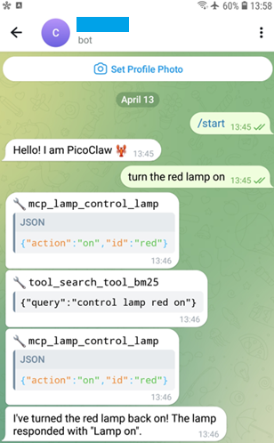
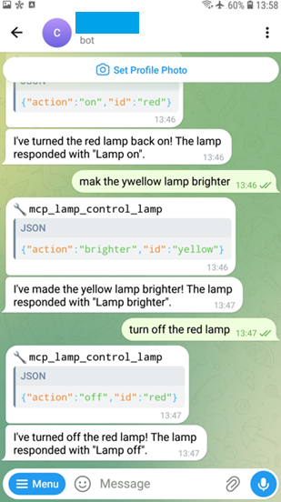
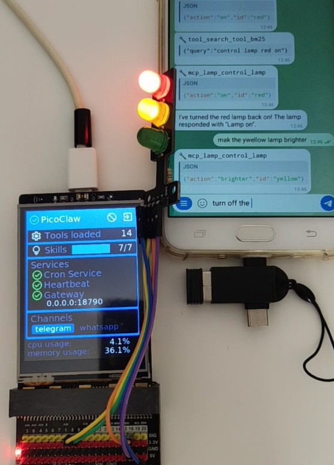

# Transforming UNIHIKER M10 into an AIoT Device with PicoClaw 

## Introduction 
This project add MCP feature to the graphical dashboard for PicoClaw, running on the UNIHIKER M10 SBC.  
Before starting, **ensure that dashboard for PicoClaw is properly set up and running on the UNIHIKER M10**. For detailed instructions, please refer to [Dashboard of running PicoClaw on UNIHIKER M10](https://community.dfrobot.com/makelog-318618.html)

[](https://github.com/teamprof/pico-audio-ml/blob/main/LICENSE)  
<a href="https://www.buymeacoffee.com/teamprof" target="_blank"></a>


## pin assignment
| pin | assignment   |
|-----|--------------|
| P8  | Yellow light |
| P9  | Green light  |
| P16 | Red light    |


## PicoClaw setup
- Refer to [Running PicoClaw on UNIHIKER M10](https://community.dfrobot.com/makelog-318617.html) to ensure PicoClaw is operating correctly.
- edit ~/.picoclaw/config.json, add MCP settings with port 5005 (This value MUST match "MCP_PORT" specified in config.py)
```
    "mcp": {
        "enabled": true,
        "servers": {
            "lamp": {
                "enabled": true,
                "url": "http://127.0.0.1:5005/mcp",
                "protocol": "http"
            }
        },
        "discovery": {
            "enabled": true,
            "ttl": 5,
            "max_search_results": 5,
            "use_bm25": true,
            "use_regex": false
        }
    },
```

## Software setup
Run the following commands to clone the project repository and install the required libraries.
```
git clone https://github.com/teamprof/unihiker-picoclaw.git
cd unihiker-picoclaw/dashboard
pip install -r requirements.txt
```


## Run app
- Ensure that the PicoClaw binary file is located at "/root/picoclaw/picoclaw", or update "config.py" to set the correct path
- **Define "MCP_PORT"** and ensure that "MCP_PORT" in config.py matches the servers-lamp port number specified in ~/.picoclaw/config.json
```
    PATH_PICOCLAW = "/root/picoclaw/picoclaw"

    MCP_PORT = 5005
```
- Launch the dashboard by executing the following command.
```
    python main.py
```
If everything goes smoothly, you should see the following screen.  
**Notice that startup time takes around 1 minute.**  
[](https://github.com/teamprof/unihiker-picoclaw/blob/main/assets/screen-start.png)  
PicoClaw is now successfully running on your UNIHIKER M10.

### Test 
- Send the message "turn the red lamp on" on Telegram.
- Wait to receive the response.  
[](https://github.com/teamprof/unihiker-picoclaw/blob/main/assets/tg-red-on.png)  

- Send the message "make the yellow lamp brightere" on Telegram.
- Wait to receive the response.  

- Send the message "turn off the red lamp" on Telegram.
- Wait to receive the response.  
[](https://github.com/teamprof/unihiker-picoclaw/blob/main/assets/tg-yellow-brighter.png)  


### Exit dashboard app
click the exit icon 
[](https://github.com/teamprof/unihiker-picoclaw/blob/main/dashboard/assets/exit.png)
or press the Button B to exit the dashboard

## Video demo
Video demo is available on [video demo](https://youtube.com/shorts/qJeA8fxbpYs)  
**Notice that startup time takes around 1 minute.**   
[](https://youtube.com/shorts/qJeA8fxbpYs)  


## License
- The project is licensed under GNU GENERAL PUBLIC LICENSE Version 3
---

## Copyright
- Copyright 2026 teamprof.net@gmail.com. All rights reserved.

